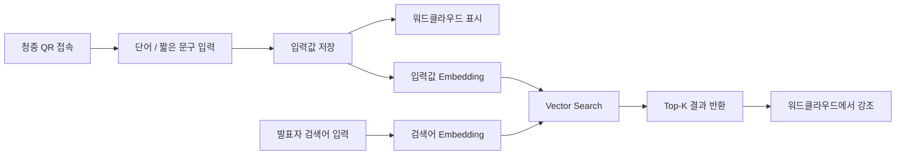

# 느낌을 검색하는 방법

> **Vector Search로 찾아내는 사용자의 의도**  
> “밥 먹을 때 볼만한 거”, “잠들기 전에 틀어놓을 영상” 같은 애매한 표현을 벡터 검색으로 찾아보는 발표용 데모입니다.

<br />

## 대충 뭐 하는 프로젝트냐면

사람은 이런 표현을 보면 대충 느낌을 압니다.

```txt
밥 먹을 때 가볍게 볼 영상
혼밥할 때 보기 좋은 짧은 음식 리뷰
```

둘이 글자는 다르지만, 분위기는 비슷합니다.  
이 프로젝트는 이런 “비슷한 느낌”을 컴퓨터가 계산할 수 있게 만드는 흐름을 보여줍니다.

발표에서는 청중이 QR로 단어를 입력하고, 발표자가 검색어를 넣으면 검색어와 의미적으로 가까운 단어들이 워드클라우드에서 강조됩니다.

<br />

## Demo Flow



<br />

## 핵심 흐름

| 단계 | 설명 |
|---|---|
| **Embedding** | 텍스트를 숫자 벡터로 바꿈 |
| **Cosine Similarity** | 두 벡터의 방향이 얼마나 비슷한지 계산 |
| **Vector Search** | 벡터 공간에서 의미적으로 가까운 데이터 검색 |
| **Top-K Retrieval** | 유사도 높은 상위 K개 결과 반환 |
| **Re-ranking** | 선호 조건, 회피 조건 등을 반영해서 최종 순서 조정 |

<br />

## 왜 만들었나

추천 시스템을 설명하려고 하면 내용이 너무 커집니다.  
유튜브나 넷플릭스 같은 서비스는 시청 기록, 클릭, 체류 시간, 협업 필터링, 랭킹 모델 같은 요소를 같이 씁니다.

이번 발표에서는 그중에서 **문장의 의미적 비슷함을 어떻게 계산하는가**에 집중했습니다.

예를 들면 이런 질문입니다.

```txt
플랫폼은 "밥 먹을 때 볼 영상"과
"혼밥할 때 보기 좋은 짧은 음식 리뷰"가
비슷하다는 걸 어떻게 알 수 있을까?
```

여기서 사용한 핵심 아이디어가 Vector Search입니다.

<br />

## 사용 예시

청중이 이런 단어를 입력했다고 가정합니다.

```txt
먹방
공포
힐링
잠들기 전
짧은 리뷰
여행
예능
편하게 볼 것
```

발표자가 검색어를 이렇게 넣습니다.

```txt
검색어: 편하게 볼 것
K: 5
```

그러면 시스템은 검색어와 의미적으로 가까운 상위 5개 단어를 찾고, 워드클라우드에서 강조합니다.

예상되는 결과는 이런 식입니다.

```txt
힐링
예능
먹방
잠들기 전
짧은 리뷰
```

검색어와 정확히 같은 단어가 없어도, 의미적으로 가까우면 결과로 나올 수 있습니다.

<br />

## 기술 스택

| 구분 | 사용 기술 |
|---|---|
| Frontend | Next.js |
| Visualization | Word Cloud |
| Embedding | Azure OpenAI Embedding Model |
| Vector Search | Azure AI Search |
| Search Logic | Cosine Similarity, Top-K Retrieval |
| 확장 아이디어 | 조건 기반 재정렬, 콘텐츠 추천 |

<br />

## 구조 한 번에 보기

```txt
청중 입력 텍스트
   ↓
Azure OpenAI Embedding
   ↓
Embedding Vector 생성
   ↓
Azure AI Search Index 저장
   ↓
발표자 검색어 입력
   ↓
검색어도 Embedding
   ↓
Vector Search 실행
   ↓
Top-K 결과 반환
   ↓
워드클라우드에서 관련 단어 강조
```

<br />

<details>
<summary><strong>Embedding이 뭔데?</strong></summary>

<br />

Embedding은 텍스트를 숫자 벡터로 바꾸는 과정입니다.

예를 들어 `"고양이"`라는 단어를 임베딩 모델에 넣으면 이런 식의 벡터가 나옵니다.

```txt
고양이
→ [0.12, -0.35, 0.81, ...]
```

중요한 점은 의미가 비슷한 텍스트가 비슷한 방향의 벡터로 표현된다는 것입니다.

```txt
개
강아지
```

이 둘은 글자는 다르지만 의미가 가깝기 때문에 벡터 공간에서도 비교적 가까운 위치에 놓일 수 있습니다.

</details>

<br />

<details>
<summary><strong>Vector Search가 하는 일</strong></summary>

<br />

Vector Search는 텍스트끼리 직접 비교하는 방식이 아닙니다.  
각 텍스트를 벡터로 바꾼 뒤, 벡터 공간에서 가까운 항목을 찾습니다.

```txt
검색어
→ Embedding
→ query_vector

청중 입력값
→ Embedding
→ word_vectors

query_vector와 word_vectors 비교
→ 의미적으로 가까운 Top-K 결과 반환
```

그래서 같은 단어가 들어가지 않아도 의미가 가까우면 검색 결과로 잡힐 수 있습니다.

</details>

<br />

<details>
<summary><strong>Top-K Retrieval 예시</strong></summary>

<br />

검색어가 다음과 같다고 가정합니다.

```txt
밥 먹을 때 볼 영상
```

후보 데이터와 유사도 점수가 이렇게 나왔다면,

| 순위 | 후보 | 유사도 |
|---|---|---:|
| 1 | 혼밥할 때 볼 영상 | 0.90 |
| 2 | 식사 중 보기 좋은 예능 | 0.75 |
| 3 | 편의점 먹방 브이로그 | 0.68 |
| 4 | 공포 게임 하이라이트 | 0.20 |

K = 2일 때 반환되는 결과는 다음 두 개입니다.

```txt
혼밥할 때 볼 영상
식사 중 보기 좋은 예능
```

</details>

<br />

## 조건 기반 재정렬

Vector Search로 먼저 후보를 찾고, 그다음 사용자의 현재 조건을 반영해서 순서를 다시 조정할 수 있습니다.

예를 들어 사용자가 이런 조건을 선택했다고 가정합니다.

```txt
선호: 짧은 영상, 가벼운 분위기, 먹방, 예능
회피: 공포, 긴 다큐, 무거운 분위기
```

최종 점수는 이런 식으로 잡을 수 있습니다.

```txt
final_score
= vector_similarity
+ preference_bonus
- negative_penalty
- duration_penalty
```

즉, 의미적으로 가까운 후보를 먼저 찾고, 이후에 선호 조건과 회피 조건을 반영해서 최종 결과를 조정합니다.

<br />

## Catnap 확장 아이디어

발표 자료에서는 이 흐름을 콘텐츠 추천 서비스 아이디어인 **Catnap**으로 확장했습니다.

Catnap은 사용자가 검색어를 직접 길게 쓰는 대신, 현재 상황과 취향을 카드로 선택하는 방식입니다.

```txt
밥친구 모드
잠들기 전 모드
짧게 웃고 싶음 모드
가볍게 틀어놓기 모드
집중 없이 보기 모드
```

예를 들어 사용자가 이렇게 선택했다고 하면,

```txt
상황: 밥친구 모드
선호: 먹방, 짧은 영상, 가벼운 분위기
회피: 공포, 긴 다큐, 무거운 분위기
```

시스템은 이 선택값을 문장형 요구로 바꿀 수 있습니다.

```txt
사용자는 밥을 먹으면서 부담 없이 볼 수 있는 짧고 가벼운 콘텐츠를 원합니다.
먹방이나 예능형 콘텐츠에 긍정적이며, 공포나 긴 다큐처럼 몰입 부담이 큰 콘텐츠는 피하고 싶어 합니다.
```

이 문장을 벡터로 만들고, 콘텐츠 설명문 벡터와 비교하면 추천 후보를 뽑을 수 있습니다.

<br />

## 발표에서 보여주는 것

- 청중이 QR로 단어 입력
- 입력값이 워드클라우드에 표시됨
- 발표자가 검색어와 K 값 입력
- 검색어와 의미적으로 가까운 단어 검색
- Top-K 단어를 워드클라우드에서 강조
- Vector Search의 원리를 화면으로 확인

<br />

## 환경변수

실제 키 값은 저장소에 올리면 안 됩니다.  
공개 저장소에는 `.env.example`만 두고, 실제 값은 `.env.local`에 따로 관리합니다.

```env
AZURE_OPENAI_ENDPOINT=
AZURE_OPENAI_API_KEY=
AZURE_OPENAI_EMBEDDING_DEPLOYMENT=
AZURE_AI_SEARCH_ENDPOINT=
AZURE_AI_SEARCH_API_KEY=
AZURE_AI_SEARCH_INDEX_NAME=
```

`.gitignore`에는 다음 항목을 추가합니다.

```gitignore
.env
.env.local
```

<br />

## 주의사항

- API Key, Endpoint, Connection String은 커밋하지 않습니다.
- 발표 중 입력된 원본 데이터는 공유용 문서에 포함하지 않습니다.
- Azure 연결 실패 상황을 대비해 fallback 화면이나 예시 결과를 준비할 수 있습니다.
- 발표 목적은 완성형 추천 서비스 시연보다는 Vector Search 원리 설명에 가깝습니다.

<br />

## 정리

이 프로젝트의 핵심은 다음 흐름입니다.

```txt
사람의 막연한 표현
→ 텍스트
→ 임베딩 벡터
→ 유사도 계산
→ Vector Search
→ Top-K 결과
→ 워드클라우드 강조
```

사람이 말하는 “비슷한 느낌”을 컴퓨터가 계산할 수 있는 벡터 유사도 문제로 바꾸고, 그 결과를 워드클라우드에서 바로 확인하는 데모입니다.

<br />

## Contributors

| 이름 | 역할 |
|---|---|
| 황준성 | 발표 / 데모 구현 |
| 김성윤 | 발표 / 자료 구성 |

<br />

## License

발표 및 교육 목적의 데모 프로젝트입니다.
